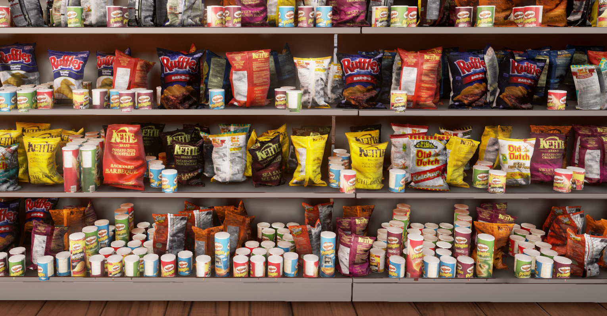
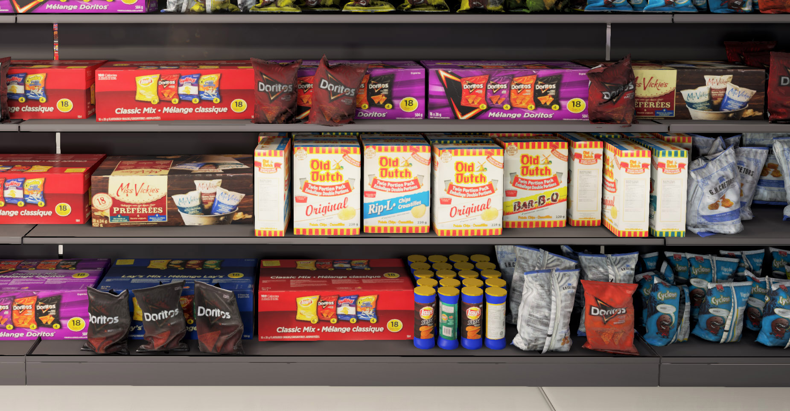

# SupermarketPlugin-AutoShuffleWindow

This repository contains the source codes for the unreal engine plugin that automatically generates virtual supermarkets described [here](https://arxiv.org/abs/1704.06752).

### Examples
<center>
<br>
</center>
<br>
<center>
<br>
</center>


### Citation
```bibtex
@article{qiao2017scalenet,
  Author = {Qiao, Siyuan and Shen, Wei and Qiu, Weichao and Liu, Chenxi and Yuille, Alan},
  Journal = {arXiv preprint arXiv:1704.06752},
  Title = {ScaleNet: Guiding Object Proposal Generation in Supermarkets and Beyond},
  Year = {2017}
}
```
